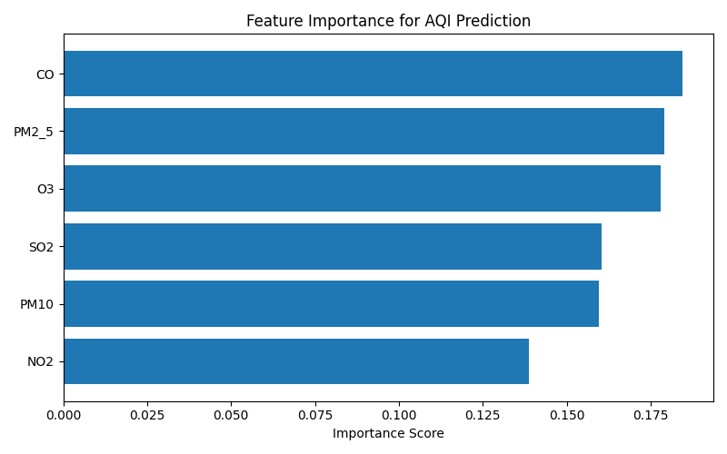

# Air Quality Prediction and Health Risk Analysis (India)

Air pollution is a growing concern in Indian cities and has a direct impact on public health.  
This project focuses on predicting the Air Quality Index (AQI) using machine learning by combining air quality data from multiple sources across major Indian cities.

The goal of the project is not just to build a model, but to understand which pollutants contribute the most to AQI and how such predictions can help in early awareness and decision-making.

---

## Problem Statement

Air Quality Index values depend on multiple pollutants such as PM2.5, PM10, CO, NO₂, SO₂, and O₃.  
However, air quality data is often scattered across different sources and formats, making analysis difficult.

This project aims to:
- Merge air quality data from multiple datasets
- Clean and preprocess the data
- Train a machine learning model to predict AQI
- Analyze the contribution of different pollutants to AQI levels

---

## Datasets Used

Two publicly available datasets were used:

1. **India AQI CSV Datasets (City-wise)**  
   Source: https://github.com/cp099/India-Air-Quality-Dataset  
   - Contains daily AQI and pollutant values for cities like Bangalore, Delhi, Mumbai, etc.

2. **AQI India Dataset (Mendeley)**  
   Source: https://data.mendeley.com/datasets/r6nk22y67y/1  
   - Provides AQI data along with geographical information (latitude and longitude).

These datasets were merged using the city name as a common attribute.

---

## Project Workflow

1. Collected AQI data from multiple sources
2. Standardized column names and date formats
3. Merged city-wise CSV files with the Mendeley dataset
4. Handled missing values using city-wise mean imputation
5. Selected key pollutant features affecting AQI
6. Trained a Random Forest Regression model
7. Evaluated the model using MAE, RMSE, and R² score
8. Analyzed feature importance to identify dominant pollutants

---

## Machine Learning Model

- **Model Used:** Random Forest Regressor  
- **Input Features:**  
  - PM2.5  
  - PM10  
  - CO  
  - NO₂  
  - SO₂  
  - O₃  
- **Target Variable:** AQI  

Random Forest was chosen because it handles non-linear relationships well and provides clear feature importance scores.

---

## Feature Importance Insight

The feature importance analysis shows that pollutants such as **Carbon Monoxide (CO)**, **PM2.5**, and **Ozone (O₃)** play a major role in determining AQI levels across Indian cities.

This highlights the impact of traffic emissions and fuel combustion on urban air quality.



---

## Societal Impact

Accurate AQI prediction can:
- Help people take preventive measures on high pollution days
- Support early warnings for sensitive groups like children and elderly
- Assist policymakers in understanding pollution sources
- Promote awareness about environmental and health risks

---

## Technologies Used

- Python  
- Pandas & NumPy  
- Scikit-learn  
- Matplotlib  
- Jupyter Notebook  
- Visual Studio Code  

---
## Future Scope

This project can be extended to real-time AQI prediction by integrating live air quality sensor data or public APIs.


## How to Run the Project

1. Clone the repository

2. Install dependencies:
```bash
   pip install -r requirements.txt
   ```
3. Open the notebook:
   notebooks/merge_datasets.ipynb


4. Run the cells step by step

**Note**
The trained model file (.pkl) is intentionally excluded from the repository and can be regenerated by running the notebook.


